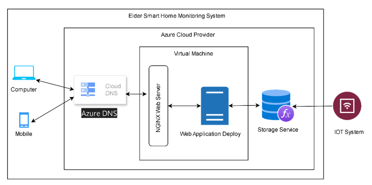
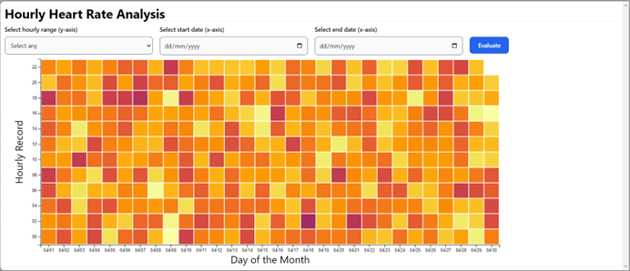
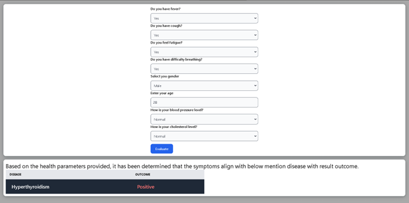
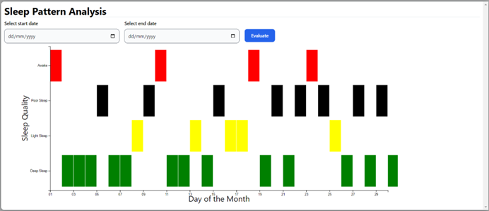
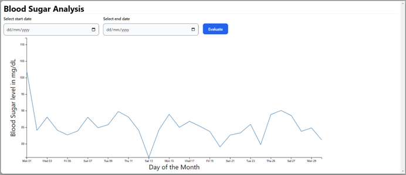

# Declaration
This an application prototype of 'Efficient Data Visualization & Machine Learning (ML) for Home care: D3 Components in Python-React on Azure with DevOps' research project. The research has been submitted to Leeds Beckett University in a partial fulfillment for the degree of the MSc. Information and Technology, May 2024.
This research has been conducted under the supervision of Dr. Gopal Jamnal, a senior lecturer at Leeds Beckett University.

# Author Information
<div>
<div>Name: <b>Narayan Joshi</b></div>
<div>Student ID: <b>77354106</b> </div>
<div>MSc. IT Software Engineering</div>
</div>

#  Efficient Data Visualization & ML for Home care: D3 Components in Python-React on Azure with DevOps
<p float="left">
<span>
Welcome to our cutting-edge application designed for comprehensive health monitoring through advanced data visualization. Our platform integrates seamlessly with various sensors via third-party applications to gather vital health metrics such as heart rate, blood pressure, sugar levels, respiratory data, and more.

All collected data is securely stored on the Azure cloud platform, ensuring reliability and accessibility. Our application retrieves this data from the cloud and employs sophisticated algorithms to generate insightful visualizations. These visual representations provide users with valuable insights into their health status, empowering them to make informed decisions about their well-being.

Furthermore, leveraging state-of-the-art machine learning algorithms, our application offers predictive analysis based on individual health parameters. By analyzing historical data and trends, our algorithm provides personalized predictions, enabling users to proactively manage their health.

Experience the future of healthcare with our innovative solution, where data-driven insights and advanced technology converge to enhance wellness and quality of life.
<div>To access a live demo application,  <a href="https://elderdatavisualization.azurewebsites.net/">Click Me</a></div>
</span>
</p>

# Language Used
1. Python 3.12 - used as backend to process data
2. ReactJS - used to visualize representation of data using d3.js

# Run Instruction in Local System
1. To run python application, please using IDE and run button.
2. To install all dependencies of frontend using below command
```
    npm i
```
3. To run the frontend application, please open your terminal and open application_dir/frontend folder and type below command
```
    npm start
```
#  Accessing Reactjs using python (Build process for deployment )
1. Run the build.bat file - this will build the reactjs and copy the final build copies to static folder to serve from python (for more information, you can see the postbuild.js file under frontend folder)
2. Run the python application
3. if deploying this application on server than deploy using python project
4. Enjoy the application using web browsers

# CSV Dataset
The csv data set for the application has been save on csv datasets directory and you can find the process to upload the dataset and makes this application work on your system on that directory readme.md file.

# Software Architecture Diagram



# Deployment workflow using CI/CD pipeline


# Data Visualization Sample Screenshot
<table style="background-color: white">
 <tr>
    <td></td>
    <td></td>
 </tr>
 <tr>
    <td></td>
    <td></td>
 </tr>
 <tr>
    <td></td>
    <td></td>
 </tr>
 <tr>
    <td></td>
    <td></td>
 </tr>
 <tr>
    <td></td>
    <td></td>
 </tr>
<tr>
    <td></td>
    <td></td>
 </tr>
</table>


